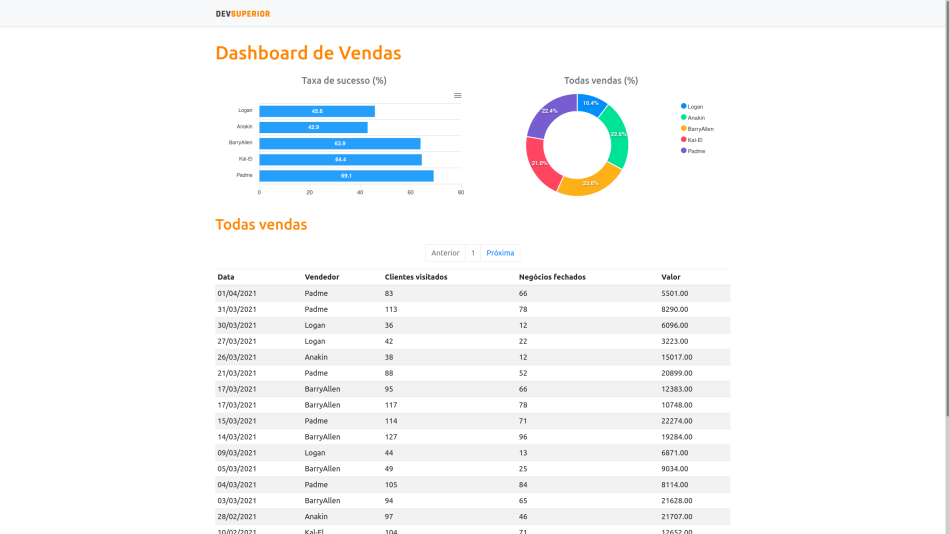
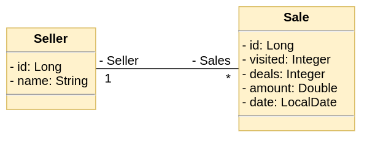
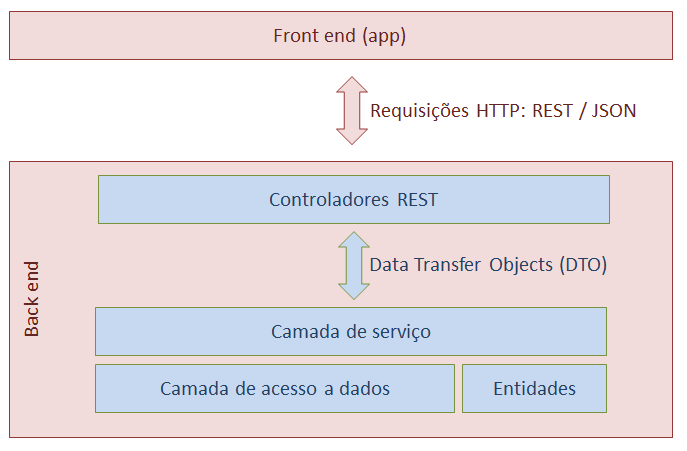

<div align="center">
  <h1 align="center">DSVendas</h1>
  <p>
    <a href="#sobre-o-projeto">Sobre o projeto</a>&nbsp;&nbsp;&nbsp;|&nbsp;&nbsp;&nbsp;
    <a href="#tecnologias">Tecnologias</a>&nbsp;&nbsp;&nbsp;|&nbsp;&nbsp;&nbsp;
    <a href="#implantação-em-produção">Implantação em produção</a>&nbsp;&nbsp;&nbsp;|&nbsp;&nbsp;&nbsp;
    <a href="#como-executar-o-projeto">Como executar o projeto</a>
  </p>
  
  
</div>

## Modelo conceitual


## Padrão camadas adotado


# Sobre o projeto
https://cleverson-dsvendas-sds3.netlify.app

DSVendas é uma aplicação full stack construída durante a 3ª edição da Semana Spring React (#sds3), evento organizado pela [DevSuperior](https://devsuperior.com.br/ "Site da DevSuperior").

Esta aplicação consiste em exibir um dashboard a partir de dados fornecidos por um back end construído com Spring Boot.

# Tecnologias
## Back end
- Java
- Spring Boot
- JPA / Hibernate
- Maven

## Front end
- HTML / JS / CSS / TypeScript
- ReactJS
- Apex Chart

# Implantação em produção
- Back end: Heroku
- Front end: Netlify
- Banco de dados: PostgreSQL

# Como executar o projeto

## Back end
Pré-requisitos: Java 11

```bash
# Clonar o repositório
git clone https://github.com/cleversonmartins/dsvendas-sds3.git

# Entrar na pasta do projeto back end
cd backend

# Executar o projeto
./mvnw spring-boot:run
```

## Front end
Pré-requisitos: npm / yarn

```bash
# Clonar o repositório
git clone https://github.com/cleversonmartins/dsvendas-sds3.git

# Entrar na pasta do projeto front end
cd frontend

# A primeira vez que for executar o projeto é necessário baixar as dependências
yarn

# Executar o projeto
yarn start
```
